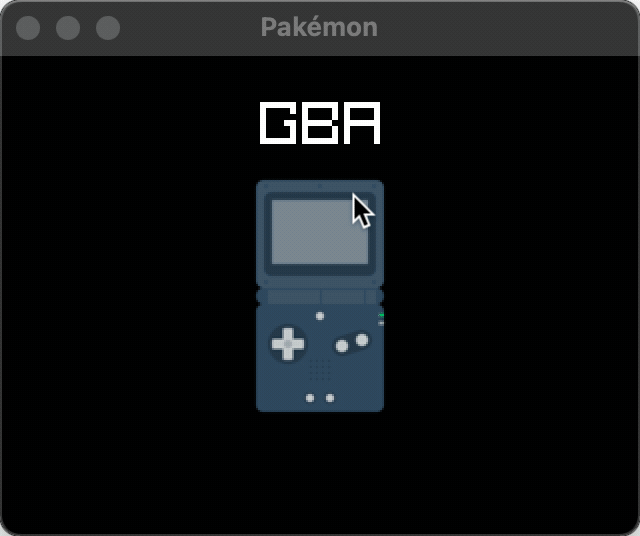

Very light & simple game-menu for loading ROMs and minigames, on a pi with a controller, from a simple menu. Eventually this will probly replace [pakemon](https://github.com/notnullgames/pakemon).



This uses the awesome automated [Raylib-Forever](https://github.com/Guevara-chan/Raylib-Forever)! bindings for nim.

It's meant to load early on pakemon hardware, and list the other things you can run (roms, pakemon minigames, etc).


```
Usage: make [target] ...

Targets:

help             Show this help message.
run              Run pakemon
linux-arm        Build release for Linux arm32 (old pi)
linux-arm64      Build release for Linux arm64 (recent pi)
linux-x86        Build release for Linux x86_64
windows          Build release for Windows x86_64
mac-arm64        Build release for Mac M1
mac-x86          Build release for x86_64
```

## roms

The idea is to use convention/code over config, like things just need to be in the right shape and it will work, and you configure by overriding things or add new dirs.

File Structure:

```
games/
  NES/
    icon.png
    roms/
      mario.nes
    ...
  SNES/
    icon.png
    roms/
      mario.smc
    ...
  Pakémon
    icon.png
    roms/
      Scanner RPG/
        icon.png
        start
````

There are some nice system icons [here](https://github.com/baxysquare/baxy-retroarch-themes/tree/master/bytheme/FlatUX/src/png/128) if you want to match the example ones I am using.

You can modify `games/list` and `games/run` to customize how it works.


## install

It is meant to be run on a pizero2w, but should run on others. Install "Raspberry Pi OS Lite" (32 or 64 bit should work ok) and run this to get it working:

```
# for 32bit
wget https://github.com/nim-lang/nightlies/releases/download/latest-version-1-6/linux_armv7l.tar.xz

# for 64 bit
# wget https://github.com/nim-lang/nightlies/releases/download/latest-version-1-6/linux_arm64.tar.xz

tar -xf linux_*.tar.xz
cd nim-1.6.5/
sudo ./install.sh /usr/local/bin

sudo apt install -y git libdrm-dev libegl1-mesa-dev libgles2-mesa-dev libgbm-dev
git clone https://github.com/raysan5/raylib.git
cd raylib\src\
make PLATFORM=PLATFORM_DRM RAYLIB_LIBTYPE=SHARED
sudo make install

cd ../..
git clone https://github.com/notnullgames/pakemon-nim.git
cd pakemon-nim
ln -s /usr/local/lib/libraylib.so.4.0.0 libraylib.so
nim compile --path=src --run src/pakemon.nim
```


Eventually, I will have CI setup to pre-builds (notes [here](https://github.com/nim-lang/Nim/wiki/BuildServices#8-cross-compilation-and-release)), so you don't need raylib/git/c-stuff/nim.


## TODO

- [use direct libretro bindings](https://github.com/RobLoach/raylib-libretro/blob/master/example/raylib-libretro-basic.c)
- down't choose core by extension (in run) use smarter libretro kind of solution to make it more automtic
- make a kind of homebrew store that can download pakemon minigames, homebrew, and other stuff.

